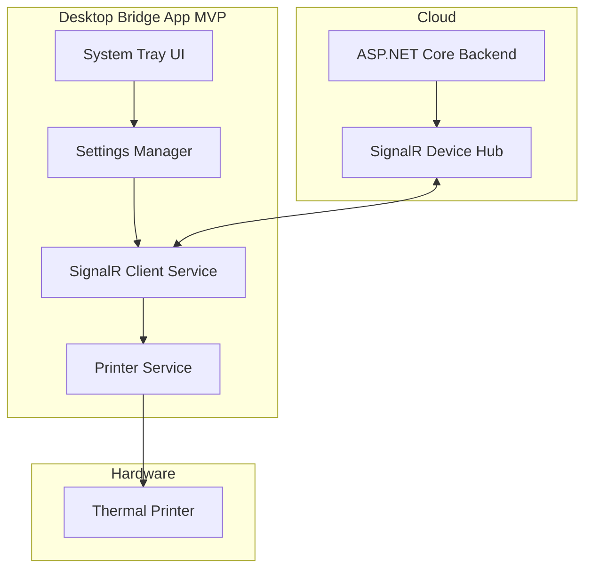

# Design Document: Desktop Bridge App (MVP)

## Overview

The Desktop Bridge App MVP is a simplified .NET 8 WPF application that connects the KasserPro backend to a local thermal printer. The initial version focuses on the core functionality: receiving print commands via SignalR and printing receipts immediately.

**MVP Scope:**
- SignalR connection to backend
- Receive print commands
- Print receipts on thermal printer using ESC/POS
- Basic error handling
- Simple system tray UI

**Future Enhancements (Out of MVP Scope):**
- Barcode scanner integration
- Cash drawer control
- Offline command queue
- Multiple device support
- Advanced error recovery

## Architecture

### High-Level Architecture (MVP)



### Technology Stack

**Desktop Application:**
- Framework: .NET 8 WPF
- SignalR Client: Microsoft.AspNetCore.SignalR.Client 8.0
- Printer Library: ESCPOS.NET 3.0 (ESC/POS command generation)
- Settings Storage: System.Text.Json
- Logging: Serilog with file sink

**Backend Integration:**
- SignalR Hub: `/hubs/devices`
- Authentication: API Key header
- Protocol: WebSocket Secure (WSS)

### Deployment Model

- Single executable (.exe) - no installer for MVP
- Settings: `%AppData%\KasserPro\settings.json`
- Logs: `%AppData%\KasserPro\logs\bridge-app.log`

## Components and Interfaces

### 1. SignalR Client Service (Simplified)

**Responsibility:** Manages the SignalR connection and receives print commands.

```csharp
public interface ISignalRClientService
{
    Task<bool> ConnectAsync();
    Task DisconnectAsync();
    bool IsConnected { get; }
    
    // Event handler for incoming print commands
    event EventHandler<PrintCommandEventArgs> OnPrintCommandReceived;
    event EventHandler<ConnectionStateChangedEventArgs> OnConnectionStateChanged;
    
    // Send print completion status back to backend
    Task SendPrintCompletedAsync(string commandId, bool success, string errorMessage);
}

public class SignalRClientService : ISignalRClientService
{
    private readonly HubConnection _hubConnection;
    private readonly ISettingsManager _settingsManager;
    private readonly ILogger<SignalRClientService> _logger;
    
    public bool IsConnected => _hubConnection?.State == HubConnectionState.Connected;
    
    public async Task<bool> ConnectAsync()
    {
        var settings = await _settingsManager.GetSettingsAsync();
        
        _hubConnection = new HubConnectionBuilder()
            .WithUrl($"{settings.BackendUrl}/hubs/devices", options =>
            {
                options.Headers.Add("X-API-Key", settings.ApiKey);
                options.Headers.Add("X-Device-Id", settings.DeviceId);
            })
            .WithAutomaticReconnect()
            .Build();
        
        RegisterHandlers();
        
        try
        {
            await _hubConnection.StartAsync();
            _logger.LogInformation("Connected to Device Hub");
            OnConnectionStateChanged?.Invoke(this, new ConnectionStateChangedEventArgs(true));
            return true;
        }
        catch (Exception ex)
        {
            _logger.LogError(ex, "Failed to connect to Device Hub");
            OnConnectionStateChanged?.Invoke(this, new ConnectionStateChangedEventArgs(false));
            return false;
        }
    }
    
    private void RegisterHandlers()
    {
        _hubConnection.On<PrintCommandDto>("PrintReceipt", async (command) =>
        {
            _logger.LogInformation("Received print command: {CommandId}", command.CommandId);
            OnPrintCommandReceived?.Invoke(this, new PrintCommandEventArgs(command));
        });
        
        _hubConnection.Reconnecting += (error) =>
        {
            _logger.LogWarning("Connection lost, reconnecting...");
            OnConnectionStateChanged?.Invoke(this, new ConnectionStateChangedEventArgs(false));
            return Task.CompletedTask;
        };
        
        _hubConnection.Reconnected += (connectionId) =>
        {
            _logger.LogInformation("Reconnected to Device Hub");
            OnConnectionStateChanged?.Invoke(this, new ConnectionStateChangedEventArgs(true));
            return Task.CompletedTask;
        };
    }
    
    public async Task SendPrintCompletedAsync(string commandId, bool success, string errorMessage)
    {
        try
        {
            await _hubConnection.InvokeAsync("PrintCompleted", new PrintCompletedEventDto
            {
                CommandId = commandId,
                Success = success,
                ErrorMessage = errorMessage,
                CompletedAt = DateTime.UtcNow
            });
        }
        catch (Exception ex)
        {
            _logger.LogError(ex, "Failed to send print completion status");
        }
    }
}
```

### 2. Printer Service (Simplified)

**Responsibility:** Discovers printers and executes print commands using ESC/POS.

```csharp
public interface IPrinterService
{
    Task InitializeAsync();
    Task<List<string>> GetAvailablePrintersAsync();
    Task<bool> PrintReceiptAsync(ReceiptDto receipt);
}

public class PrinterService : IPrinterService
{
    private readonly ILogger<PrinterService> _logger;
    private readonly ISettingsManager _settingsManager;
    
    public async Task InitializeAsync()
    {
        _logger.LogInformation("Initializing printer service");
        var printers = await GetAvailablePrintersAsync();
        _logger.LogInformation("Found {Count} printers", printers.Count);
    }
    
    public async Task<List<string>> GetAvailablePrintersAsync()
    {
        // Get all installed printers from Windows
        var printers = new List<string>();
        foreach (string printerName in PrinterSettings.InstalledPrinters)
        {
            printers.Add(printerName);
        }
        return printers;
    }
    
    public async Task<bool> PrintReceiptAsync(ReceiptDto receipt)
    {
        try
        {
            var settings = await _settingsManager.GetSettingsAsync();
            var printerName = settings.DefaultPrinterName;
            
            if (string.IsNullOrEmpty(printerName))
            {
                _logger.LogError("No default printer configured");
                return false;
            }
            
            var escPosBytes = GenerateReceiptEscPos(receipt);
            await SendToPrinterAsync(printerName, escPosBytes);
            
            _logger.LogInformation("Receipt printed successfully: {ReceiptNumber}", receipt.ReceiptNumber);
            return true;
        }
        catch (Exception ex)
        {
            _logger.LogError(ex, "Failed to print receipt: {ReceiptNumber}", receipt.ReceiptNumber);
            return false;
        }
    }
    
    private byte[] GenerateReceiptEscPos(ReceiptDto receipt)
    {
        var printer = new EscPosPrinter();
        
        // Initialize printer
        printer.Initialize();
        
        // Header - centered, double size
        printer.SetAlignment(Alignment.Center);
        printer.SetTextSize(2, 2);
        printer.WriteLine(receipt.BranchName);
        printer.SetTextSize(1, 1);
        printer.WriteLine($"Receipt: {receipt.ReceiptNumber}");
        printer.WriteLine($"{receipt.Date:yyyy-MM-dd HH:mm}");
        printer.WriteLine("================================");
        
        // Items - left aligned
        printer.SetAlignment(Alignment.Left);
        foreach (var item in receipt.Items)
        {
            printer.WriteLine($"{item.Name}");
            printer.WriteLine($"  {item.Quantity} x {item.UnitPrice:F2} = {item.TotalPrice:F2} EGP");
        }
        
        printer.WriteLine("================================");
        
        // Totals
        printer.WriteLine($"Subtotal:     {receipt.NetTotal:F2} EGP");
        printer.WriteLine($"Tax (14%):    {receipt.TaxAmount:F2} EGP");
        printer.SetBold(true);
        printer.SetTextSize(1, 2);
        printer.WriteLine($"TOTAL:        {receipt.TotalAmount:F2} EGP");
        printer.SetBold(false);
        printer.SetTextSize(1, 1);
        
        printer.WriteLine($"Payment:      {receipt.PaymentMethod}");
        printer.WriteLine($"Cashier:      {receipt.CashierName}");
        
        // Barcode
        printer.SetAlignment(Alignment.Center);
        printer.PrintBarcode(BarcodeType.Code128, receipt.ReceiptNumber);
        
        // Cut paper
        printer.Feed(3);
        printer.Cut();
        
        return printer.GetBytes();
    }
    
    private async Task SendToPrinterAsync(string printerName, byte[] data)
    {
        // Send raw bytes to printer using Windows printing
        using var printDocument = new PrintDocument();
        printDocument.PrinterSettings.PrinterName = printerName;
        
        printDocument.PrintPage += (sender, e) =>
        {
            // Write raw ESC/POS bytes to printer
            e.Graphics.DrawString(
                Encoding.Default.GetString(data),
                new Font("Courier New", 10),
                Brushes.Black,
                new PointF(0, 0)
            );
        };
        
        printDocument.Print();
        await Task.CompletedTask;
    }
}
```

### 3. Settings Manager (Simplified)

**Responsibility:** Manages basic application configuration.

```csharp
public interface ISettingsManager
{
    Task<AppSettings> GetSettingsAsync();
    Task SaveSettingsAsync(AppSettings settings);
}

public class SettingsManager : ISettingsManager
{
    private readonly string _settingsFilePath;
    private readonly ILogger<SettingsManager> _logger;
    private AppSettings _cachedSettings;
    
    public SettingsManager(ILogger<SettingsManager> logger)
    {
        var appDataPath = Path.Combine(
            Environment.GetFolderPath(Environment.SpecialFolder.ApplicationData),
            "KasserPro"
        );
        Directory.CreateDirectory(appDataPath);
        _settingsFilePath = Path.Combine(appDataPath, "settings.json");
        _logger = logger;
    }
    
    public async Task<AppSettings> GetSettingsAsync()
    {
        if (_cachedSettings != null)
            return _cachedSettings;
        
        if (!File.Exists(_settingsFilePath))
        {
            _cachedSettings = CreateDefaultSettings();
            await SaveSettingsAsync(_cachedSettings);
            return _cachedSettings;
        }
        
        var json = await File.ReadAllTextAsync(_settingsFilePath);
        _cachedSettings = JsonSerializer.Deserialize<AppSettings>(json);
        return _cachedSettings;
    }
    
    public async Task SaveSettingsAsync(AppSettings settings)
    {
        var json = JsonSerializer.Serialize(settings, new JsonSerializerOptions
        {
            WriteIndented = true
        });
        
        await File.WriteAllTextAsync(_settingsFilePath, json);
        _cachedSettings = settings;
        _logger.LogInformation("Settings saved");
    }
    
    private AppSettings CreateDefaultSettings()
    {
        return new AppSettings
        {
            DeviceId = Guid.NewGuid().ToString(),
            BackendUrl = "https://localhost:5243",
            ApiKey = "",
            DefaultPrinterName = ""
        };
    }
}

public class AppSettings
{
    public string DeviceId { get; set; }
    public string BackendUrl { get; set; }
    public string ApiKey { get; set; }
    public string DefaultPrinterName { get; set; }
}
```

### 4. System Tray UI (Simplified)

**Responsibility:** Provides minimal UI through system tray icon.

```csharp
public class SystemTrayManager
{
    private readonly NotifyIcon _trayIcon;
    private readonly ISignalRClientService _signalRClient;
    private readonly ISettingsManager _settingsManager;
    
    public void Initialize()
    {
        _trayIcon = new NotifyIcon
        {
            Icon = SystemIcons.Application,
            Visible = true,
            Text = "KasserPro Bridge - Disconnected"
        };
        
        _trayIcon.ContextMenuStrip = CreateContextMenu();
        _signalRClient.OnConnectionStateChanged += OnConnectionStateChanged;
    }
    
    private ContextMenuStrip CreateContextMenu()
    {
        var menu = new ContextMenuStrip();
        menu.Items.Add("Settings", null, OnSettingsClick);
        menu.Items.Add("Test Print", null, OnTestPrintClick);
        menu.Items.Add(new ToolStripSeparator());
        menu.Items.Add("Exit", null, OnExitClick);
        return menu;
    }
    
    private void OnConnectionStateChanged(object sender, ConnectionStateChangedEventArgs e)
    {
        if (e.IsConnected)
        {
            _trayIcon.Text = "KasserPro Bridge - Connected";
            _trayIcon.ShowBalloonTip(2000, "Connected", "Connected to backend", ToolTipIcon.Info);
        }
        else
        {
            _trayIcon.Text = "KasserPro Bridge - Disconnected";
            _trayIcon.ShowBalloonTip(2000, "Disconnected", "Connection lost", ToolTipIcon.Warning);
        }
    }
    
    private void OnSettingsClick(object sender, EventArgs e)
    {
        // Open settings window
        var settingsWindow = new SettingsWindow(_settingsManager);
        settingsWindow.ShowDialog();
    }
    
    private async void OnTestPrintClick(object sender, EventArgs e)
    {
        // Print a test receipt
        MessageBox.Show("Test print feature coming soon");
    }
    
    private void OnExitClick(object sender, EventArgs e)
    {
        Application.Exit();
    }
}
```

## Data Models

### DTOs for SignalR Communication

```csharp
// Command from Backend to Desktop App
public class PrintCommandDto
{
    public string CommandId { get; set; }
    public ReceiptDto Receipt { get; set; }
}

public class ReceiptDto
{
    public string ReceiptNumber { get; set; }
    public string BranchName { get; set; }
    public DateTime Date { get; set; }
    public List<ReceiptItemDto> Items { get; set; }
    public decimal NetTotal { get; set; }
    public decimal TaxAmount { get; set; }
    public decimal TotalAmount { get; set; }
    public string PaymentMethod { get; set; }
    public string CashierName { get; set; }
}

public class ReceiptItemDto
{
    public string Name { get; set; }
    public int Quantity { get; set; }
    public decimal UnitPrice { get; set; }
    public decimal TotalPrice { get; set; }
}

// Event from Desktop App to Backend
public class PrintCompletedEventDto
{
    public string CommandId { get; set; }
    public bool Success { get; set; }
    public string ErrorMessage { get; set; }
    public DateTime CompletedAt { get; set; }
}
```

### Backend SignalR Hub (Simplified)

```csharp
public class DeviceHub : Hub
{
    private readonly ILogger<DeviceHub> _logger;
    private static readonly Dictionary<string, string> _deviceConnections = new();
    
    public override async Task OnConnectedAsync()
    {
        var deviceId = Context.GetHttpContext().Request.Headers["X-Device-Id"].ToString();
        var apiKey = Context.GetHttpContext().Request.Headers["X-API-Key"].ToString();
        
        // Validate API key (simplified for MVP)
        if (string.IsNullOrEmpty(apiKey))
        {
            Context.Abort();
            return;
        }
        
        _deviceConnections[deviceId] = Context.ConnectionId;
        _logger.LogInformation("Device {DeviceId} connected", deviceId);
        
        await base.OnConnectedAsync();
    }
    
    public override async Task OnDisconnectedAsync(Exception exception)
    {
        var deviceId = Context.GetHttpContext().Request.Headers["X-Device-Id"].ToString();
        _deviceConnections.Remove(deviceId);
        _logger.LogInformation("Device {DeviceId} disconnected", deviceId);
        
        await base.OnDisconnectedAsync(exception);
    }
    
    // Called by Desktop App to report print completion
    public async Task PrintCompleted(PrintCompletedEventDto eventDto)
    {
        _logger.LogInformation("Print completed: {CommandId}, Success: {Success}", 
            eventDto.CommandId, eventDto.Success);
        
        // Notify web clients that print is complete
        await Clients.All.SendAsync("PrintCompleted", eventDto);
    }
}

// Service to send print commands to devices
public class DeviceCommandService
{
    private readonly IHubContext<DeviceHub> _hubContext;
    private readonly ILogger<DeviceCommandService> _logger;
    
    public async Task<bool> SendPrintCommandAsync(PrintCommandDto command)
    {
        try
        {
            // Send to all connected devices (simplified for MVP)
            await _hubContext.Clients.All.SendAsync("PrintReceipt", command);
            _logger.LogInformation("Print command sent: {CommandId}", command.CommandId);
            return true;
        }
        catch (Exception ex)
        {
            _logger.LogError(ex, "Failed to send print command");
            return false;
        }
    }
}
```

## Correctness Properties

A property is a characteristic or behavior that should hold true across all valid executions of a system—essentially, a formal statement about what the system should do. Properties serve as the bridge between human-readable specifications and machine-verifiable correctness guarantees.

### Property 1: SignalR Connection Establishment

*For any* valid backend URL and API key, calling ConnectAsync should establish a SignalR connection and return true.

**Validates: Requirements 1.1**

### Property 2: Print Command Reception

*For any* print command sent from the backend, the Desktop App should receive it via the OnPrintCommandReceived event within 2 seconds.

**Validates: Requirements 3.2**

### Property 3: ESC/POS Receipt Generation

*For any* valid ReceiptDto, the generated ESC/POS byte sequence should contain: initialization commands, header text, item lines, totals, and a barcode.

**Validates: Requirements 3.2, 4.1**

### Property 4: Receipt Content Completeness

*For any* receipt, the printed output should contain all required fields: branch name, receipt number, date, items, subtotal, tax (14%), total, payment method, and cashier name.

**Validates: Requirements 4.1**

### Property 5: Print Completion Acknowledgment

*For any* successfully printed receipt, the Desktop App should send a PrintCompletedEventDto to the backend with Success=true within 3 seconds.

**Validates: Requirements 3.3**

### Property 6: Settings Persistence Round Trip

*For any* valid AppSettings object, saving it to JSON and loading it back should produce an equivalent settings object with all fields matching.

**Validates: Requirements 8.2**

### Property 7: Connection State UI Synchronization

*For any* connection state change (connected/disconnected), the system tray icon text should update to reflect the new state within 1 second.

**Validates: Requirements 1.4**

## Error Handling

### Error Codes (MVP)

| Error Code | Description | Recovery Action |
|------------|-------------|-----------------|
| `CONNECTION_FAILED` | Failed to connect to SignalR hub | Display error, allow retry |
| `PRINTER_NOT_CONFIGURED` | No default printer set | Display error, open settings |
| `PRINTER_NOT_FOUND` | Configured printer not available | Display error, list available printers |
| `PRINT_FAILED` | Print job failed | Log error, notify backend |

### Error Recovery (MVP)

**Connection Errors:**
- SignalR automatic reconnection handles most cases
- Display notification when connection is lost/restored

**Printer Errors:**
- Log error details
- Send failure notification to backend
- Display error message to user

## Testing Strategy

### Unit Testing

**Test Organization:**
- `SignalRClientServiceTests`: Connection, message handling
- `PrinterServiceTests`: ESC/POS generation, print execution
- `SettingsManagerTests`: Settings persistence, validation

**Example Unit Test:**

```csharp
[Fact]
public void PrinterService_GeneratesCorrectEscPosForReceipt()
{
    // Arrange
    var receipt = new ReceiptDto
    {
        ReceiptNumber = "R-001",
        BranchName = "Main Branch",
        Items = new List<ReceiptItemDto>
        {
            new() { Name = "Product A", Quantity = 2, UnitPrice = 10.00m, TotalPrice = 20.00m }
        },
        NetTotal = 20.00m,
        TaxAmount = 2.80m,
        TotalAmount = 22.80m
    };
    
    // Act
    var escPosBytes = printerService.GenerateReceiptEscPos(receipt);
    
    // Assert
    Assert.Contains(Encoding.UTF8.GetBytes("Main Branch"), escPosBytes);
    Assert.Contains(Encoding.UTF8.GetBytes("R-001"), escPosBytes);
}
```

### Integration Testing

**SignalR Integration:**
- Test connection to real backend
- Test print command delivery
- Test print completion notification

**Printer Integration:**
- Test with actual thermal printer (manual)
- Verify ESC/POS commands work correctly

### Manual Testing Checklist

- [ ] App starts and minimizes to system tray
- [ ] Settings window opens and saves configuration
- [ ] Connection to backend succeeds with valid API key
- [ ] Print command received from backend
- [ ] Receipt prints correctly on thermal printer
- [ ] Print completion sent back to backend
- [ ] Connection lost notification appears
- [ ] Automatic reconnection works

